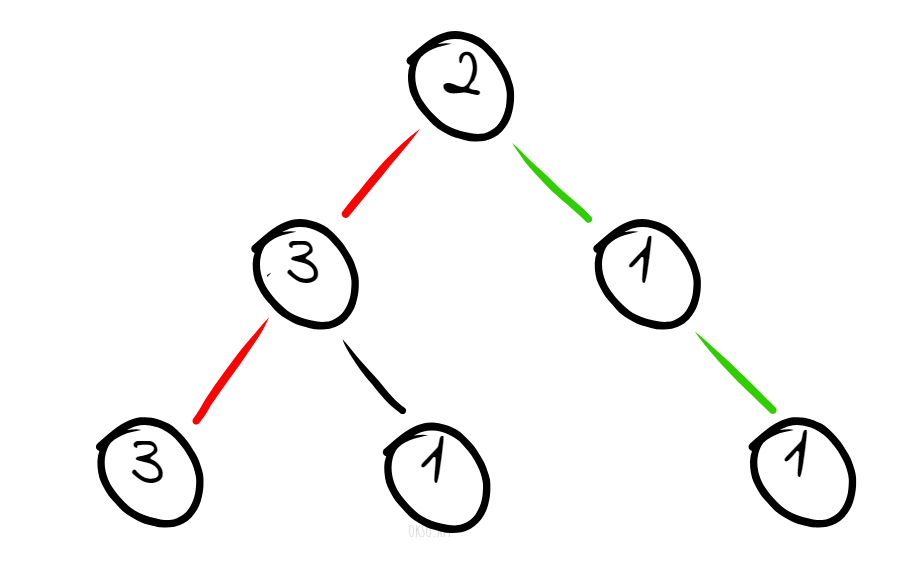

## 1457. Pseudo Palindromic Paths in a Binary Tree
### Brief Description
- You are given a binary tree where node values are digits from 1 to 9.
- pseudo palindrome is an array of integers that can be rearranged to form a palindrome. 
- i.e. any permutation of the array is a palindrome then array is pseudo-palindrome.
- Return the number of pseudo-palindromic paths going from the root node to leaf nodes.

**Example:** \

>**Input:** root = `[2,3,1,3,1,null,1]` \
**Output:** 2 \
**Explanation:** The figure above represents the given binary tree. There are three paths going from the root node to leaf nodes: the red path `[2,3,3]`, the green path `[2,1,1]`, and the path `[2,3,1]`. Among these paths only red path and green path are pseudo-palindromic paths since the red path `[2,3,3]` can be rearranged in `[3,2,3]` (palindrome) and the green path `[2,1,1]` can be rearranged in `[1,2,1]` (palindrome).

[pseudo-palindromic-paths-in-a-binary-tree on leetcode](https://leetcode.com/problems/pseudo-palindromic-paths-in-a-binary-tree/description/)

## Solution
### Intuition
- We want to check if paths in a tree can form a pseudo palindrome.
- We'll need to iterate over all paths and store the counts of each value.
- Instead of using a hashmap, we use a bitmask to represent digit counts, reducing space complexity to O(1). 
- Checking for odd/even counts is optimized to O(1) using bitwise operations. 

### Approach
#### Counting the Nodes:
- As we are traversing each path from root to leaf in the tree, to check if it is a palindrome, we'll need to keep track of the count of each encountered value.
- So we'll store the count into a hashmap.
- **Example:** For a path 1 -> 2 -> 1 -> 3 the hashmap would look like {1:2, 2:1, 3:1}.

#### Checking the palindrome possibility:
- At the end of each path, i.e., once reaching the leaf nodes, we can check the counts hashmap and determine if the path forms a palindrome.
- We'll have 3 cases:

1. If the counts of all the values are even, it's guaranteed to form a palindrome.
**Example:** for a path 3 -> 1 -> 2 -> 2 -> 3 -> 1, the hashmap would be {3:2, 1:2, 2:2} \
and palindromes such as 312213, 132231, 123321 etc. can be formed. 
2. If only one of the counts in the map is odd, still a palindrome is guaranteed.
**Example:** for a path 3 -> 2 -> 4 -> 1 -> 4 -> 2 -> 4 -> 1 -> 3, the hashmap would be {3:2, 1:2, 4:3, 2:2} \
and the palindromes such as 132444231, 124343421, 423141324 etc can be formed. \
3. If more than one of the counts in the map are odd, A palindrome can never be formed. \
**Example:** for a path 3 -> 2 -> 4 -> 1 -> 4 -> 2 -> 4 -> 1 -> 3 -> 2, the hashmap would be {3:2, 1:2, 4:3, 2:3}
a palindrome can never be formed since the total length is even and there will always be 2 distinct middle elements.

#### Optimizations
- Now using the hashmap for storing counts is ideal but not very efficient since to check for the even/odd counts, we'll need to go through the entire hashmap.
- Instead we could use bit-mapping to represent the parity(odd-1/even-0) by mapping each bit of the integer to a digit from 1-9 (since in the question constraint the node values are 1-9 only).
- **Example:** If the bit mask is 0001101010, it means that the count of digits 1,3,5,6 are odd while 2,4,7,8,9 are even. 
- To check the odd counts we just need to count the set bits in the bitmask(bit-map), ans since we need only one bit set, we could just check if the bitmask is a power of 2 (since if only one bit is set the number is a power of 2).

### Time Complexity
O(n) since all the nodes are visited once.
### Space Complexity
O(1) since we are using bit-mapping to store the counts.
